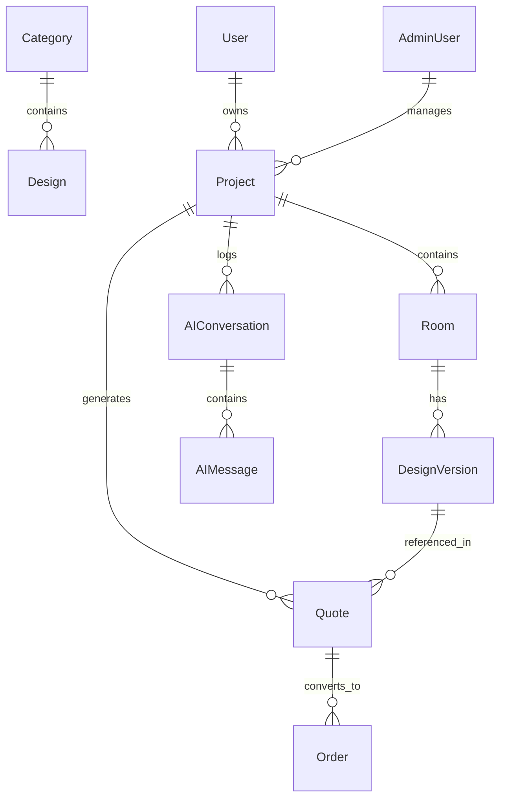

# Database Design: HomeCraft AI
**Prisma Schema and Relational Model Architecture**

---

## 1. Schema Architecture
The database is built on PostgreSQL, utilizing the Prisma ORM. We will extend the existing schema to support multi-user projects, AI generation histories, and CRM task tracking.



---

## 2. Updated Prisma Models (DDL Specifications)

Add the following structures to `packages/database/prisma/schema.prisma`:

```prisma
// ─ New Customer Authentication ────────────────────────────────────────────────
model User {
  id           String    @id @default(cuid())
  email        String    @unique
  passwordHash String
  name         String
  phone        String?
  location     String?   // City/Area (e.g. "Karnal")
  createdAt    DateTime  @default(now())
  updatedAt    DateTime  @updatedAt

  projects     Project[]
}

// ─ Customer Projects ──────────────────────────────────────────────────────────
model Project {
  id           String    @id @default(cuid())
  name         String    // e.g., "Sector 13 Apartment"
  userId       String
  houseType    String    // "Apartment" | "Villa" | "Office" | etc.
  areaSqft     Int
  budget       Float?
  status       String    @default("NEW_LEAD") // CRM pipeline status
  notes        String?
  assignedToId String?   // AdminUser ID representing assigned staff
  createdAt    DateTime  @default(now())
  updatedAt    DateTime  @updatedAt

  user         User      @relation(fields: [userId], references: [id], onDelete: Cascade)
  assignedTo   AdminUser? @relation("StaffAssignments", fields: [assignedToId], references: [id])
  rooms        Room[]
  quotes       Quote[]
  conversations AIConversation[]
  activityLogs ActivityLog[]

  @@index([userId])
  @@index([status])
}

// ─ Rooms in a Project ─────────────────────────────────────────────────────────
model Room {
  id           String    @id @default(cuid())
  projectId    String
  roomType     String    // "Kitchen" | "MasterBedroom" | "TVUnit" | etc.
  name         String?   // Custom nickname e.g. "Guest Bedroom"
  dimensions   Json?     // stores { length: Float, width: Float, height: Float }
  notes        String?
  createdAt    DateTime  @default(now())
  updatedAt    DateTime  @updatedAt

  project      Project   @relation(fields: [projectId], references: [id], onDelete: Cascade)
  versions     DesignVersion[]

  @@index([projectId])
}

// ─ Design Versions (AI Renders & Estimator Output) ───────────────────────────
model DesignVersion {
  id             String   @id @default(cuid())
  roomId         String
  imageUrl       String   // Render output hosted on Cloudinary
  style          String   // e.g. "Modern"
  budgetTier     String   // "BUDGET" | "STANDARD" | "PREMIUM"
  dimensionsUsed Json?    // Snapshot of dimensions when estimated
  materialList   Json?    // Detailed array of materials: [{ key, qty, rate, cost }]
  estimatedCost  Float?   // Total cost snapshot
  isFavorite     Boolean  @default(false)
  promptUsed     String?  // The text prompt used for diffusion
  parentVersionId String? // self-relation for tracking history lineage
  createdAt      DateTime @default(now())

  room           Room           @relation(fields: [roomId], references: [id], onDelete: Cascade)
  parentVersion  DesignVersion? @relation("VersionHistory", fields: [parentVersionId], references: [id])
  childVersions  DesignVersion[] @relation("VersionHistory")
  quotes         Quote[]

  @@index([roomId])
}

// ─ AI Conversation Context & Log ──────────────────────────────────────────────
model AIConversation {
  id        String   @id @default(cuid())
  projectId String
  createdAt DateTime @default(now())
  updatedAt DateTime @updatedAt

  project   Project  @relation(fields: [projectId], references: [id], onDelete: Cascade)
  messages  AIMessage[]

  @@index([projectId])
}

model AIMessage {
  id             String   @id @default(cuid())
  conversationId String
  sender         String   // "USER" | "AI"
  text           String
  metadata       Json?    // Stores suggested product IDs, design version IDs, etc.
  createdAt      DateTime @default(now())

  conversation   AIConversation @relation(fields: [conversationId], references: [id], onDelete: Cascade)

  @@index([conversationId])
}

// ─ Quotes & Orders ──────────────────────────────────────────────────────────
model Quote {
  id              String        @id @default(cuid())
  projectId       String
  designVersionId String
  totalAmount     Float
  status          String        @default("DRAFT") // DRAFT, SENT, ACCEPTED, REJECTED
  validUntil      DateTime
  createdAt       DateTime      @default(now())
  updatedAt       DateTime      @updatedAt

  project         Project       @relation(fields: [projectId], references: [id])
  designVersion   DesignVersion @relation(fields: [designVersionId], references: [id])
  orders          Order[]

  @@index([projectId])
}

model Order {
  id          String   @id @default(cuid())
  quoteId     String
  status      String   @default("PENDING") // PENDING, PROCESSING, COMPLETED, CANCELLED
  totalPaid   Float
  paymentLogs Json?    // Transaction IDs, dates
  createdAt   DateTime @default(now())
  updatedAt   DateTime @updatedAt

  quote       Quote    @relation(fields: [quoteId], references: [id])
}

// ─ Activity Audit Logs ────────────────────────────────────────────────────────
model ActivityLog {
  id        String   @id @default(cuid())
  projectId String
  actor     String   // "USER" | "ADMIN"
  actorId   String   // The ID of the user or admin user
  action    String   // "CREATE_PROJECT" | "GENERATE_DESIGN" | "APPROVE_QUOTE"
  details   String?  // Human readable description
  createdAt DateTime @default(now())

  project   Project  @relation(fields: [projectId], references: [id], onDelete: Cascade)

  @@index([projectId])
}
```

---

## 3. Data Integrity & Indexing Strategy
- **Cascading Deletes:** Deleting a `User` cascades to delete their `Projects`, which cascades to delete all `Rooms`, which cascades to delete all `DesignVersions`, ensuring no orphan assets.
- **Indexes:**
  - Foreign keys (`userId`, `projectId`, `roomId`) are indexed explicitly using `@@index` to optimize API query performance.
  - CRM state (`Project.status`) is indexed to ensure fast rendering of the Admin Kanban board.
