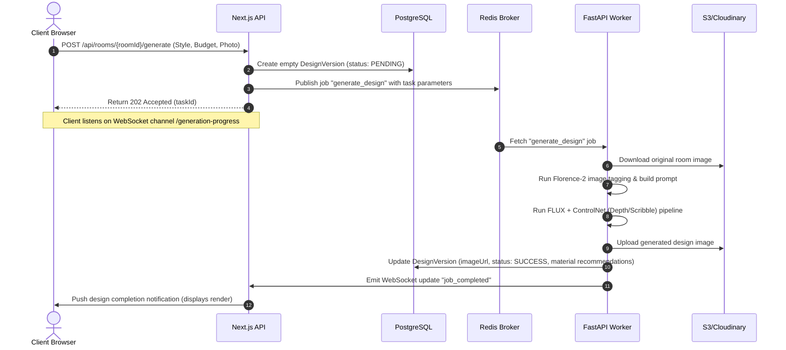

# System Architecture: HomeCraft AI
**Monorepo and Microservices Engineering Architecture**

---

## 1. System Topology Overview
The system is built as a Turborepo monorepo, combining a Next.js frontend application with a FastAPI backend for handling heavy AI pipelines and ML APIs.

```
                  ┌──────────────────────┐
                  │    Web Browser       │
                  │   (Next.js App)      │
                  └──────────┬───────────┘
                             │
                             ├──────────────────────────┐
                 HTTP / WS   │              HTTP (REST) │
              (Auth/Workspace)                          │ (ML/Generation Tasks)
                             ▼                          ▼
                  ┌──────────────────────┐    ┌──────────────────────┐
                  │      Next.js         │    │       FastAPI        │
                  │   API & Dashboard    │    │     AI Engine        │
                  └──────────┬───────────┘    └──────────┬───────────┘
                             │                           │
                             ├──────────────┬────────────┤
                             ▼              ▼            ▼
                      ┌──────────┐    ┌──────────┐  ┌──────────┐
                      │PostgreSQL│    │  Redis   │  │ Cloudinary /
                      │ (Prisma) │    │ (Queue)  │  │    S3    │
                      └──────────┘    └──────────┘  └──────────┘
```

---

## 2. Component Architecture

### A. Next.js Application (`apps/web`)
- **Role:** Handles core user interactions, landing page, customer dashboard, project workspaces, and the admin CRM interface.
- **Framework:** Next.js 16 (React 19, Server Components) utilizing Tailwind CSS 4.
- **State Management:** React Session Context + Cookie-based JWT sessions.
- **Database Access:** Direct queries via Prisma Client.

### B. FastAPI Microservice (`apps/ai` or standalone)
- **Role:** Processes incoming image generation commands, runs ControlNet preprocessors, segments images using SAM2 (Segment Anything 2), and executes prompt generation.
- **Framework:** FastAPI (Python 3.11).
- **GPU Integration:** Integrates with local PyTorch runtime (when running on GPU-equipped VMs) or delegates to external serverless APIs (Replicate, HuggingFace, RunPod) using asynchronous HTTP clients.

### C. Storage & Cache Layers
- **PostgreSQL:** Stores transactional user records, relational project schemas, and price books.
- **Redis:**
  - Used for rate-limiting, session caching, and Pub/Sub.
  - Serves as the message broker for Celery (Python) / BullMQ (Node) to manage long-running AI task queues asynchronously.
- **Cloudinary / S3:** Object storage for uploaded room photos and AI-generated design versions.

---

## 3. Key Data Flow: AI Design Generation Pipeline



---

## 4. Multi-Tenant / Workspace Isolation
- All queries fetching projects, rooms, or design versions must be filtered by the requesting customer's authenticated `userId`.
- Administrator queries bypass `userId` restrictions but are restricted via the `role === "admin"` middleware check.
- Static assets stored on Cloudinary are organized into directory subfolders matching the format: `/goel-traders/projects/{projectId}/rooms/{roomId}/`.
