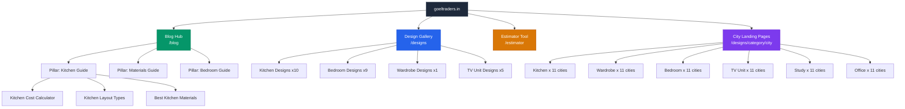

# 🔍 Complete SEO Audit Report — goeltraders.in

**Audit Date:** June 15, 2026
**Website:** https://www.goeltraders.in/
**Tech Stack:** Next.js (Turbopack), Cloudinary CDN, Vercel Hosting
**Business:** Goel Traders Design Studio — Interior design materials dealer (Gharaunda, Haryana)

---

## Executive Summary

| Metric | Score | Rating |
|---|---|---|
| **Overall SEO Score** | **62/100** | 🟡 Needs Work |
| Technical SEO | 72/100 | 🟢 Good Foundation |
| On-Page SEO | 48/100 | 🔴 Critical Gaps |
| Performance | 88/100 | 🟢 Strong |
| UX / CRO | 55/100 | 🟡 Moderate |
| Content SEO | 35/100 | 🔴 Very Weak |
| Authority / Backlinks | 20/100 | 🔴 New Domain |
| AI Search Readiness | 40/100 | 🟡 Needs Strategy |

> [!IMPORTANT]
> **The site has an excellent technical foundation** (Next.js SSR, structured data, fast load times) but is severely underperforming on **content depth, indexation, on-page optimization, and domain authority**. The biggest ROI will come from **content creation** and **on-page fixes**.

---

# 1. Technical SEO Audit

## 1.1 Crawlability & Indexability

| Check | Status | Severity | Notes |
|---|---|---|---|
| `robots.txt` | ✅ Present | — | Allows all, blocks `/admin`, `/api`, `/dashboard`, `/account` |
| XML Sitemap | ✅ Present | — | 96 URLs, properly formatted with `<lastmod>`, `<changefreq>`, `<priority>` |
| `lang` attribute | ✅ `en` | — | Properly set on `<html>` |
| HTTPS | ✅ Forced | — | Full SSL via Vercel |
| Canonical tags | ⚠️ Missing | **High** | No `<link rel="canonical">` on ANY page |
| Google Indexation | 🔴 **0 pages indexed** | **Critical** | `site:goeltraders.in` returns zero results |
| `noindex` directives | ✅ None found | — | No blocking directives detected |

> [!CAUTION]
> **CRITICAL: Zero Google-indexed pages.** The site appears to have NO pages in Google's index. This is the single most urgent issue. Possible causes:
> 1. Domain is very new and hasn't been crawled yet
> 2. Missing Google Search Console verification
> 3. Sitemap not submitted to Google
> 4. Potential server-side rendering issues preventing Googlebot from seeing content

### Fix: Submit to Google Search Console
```
1. Go to https://search.google.com/search-console
2. Add property: https://www.goeltraders.in/
3. Verify via DNS or HTML tag
4. Submit sitemap: https://goeltraders.in/sitemap.xml
5. Request indexing for the homepage manually
```

## 1.2 Robots.txt Analysis

```
User-Agent: *
Allow: /
Disallow: /admin
Disallow: /api
Disallow: /dashboard
Disallow: /account

Sitemap: https://goeltraders.in/sitemap.xml
```

| Issue | Severity | Fix |
|---|---|---|
| Sitemap URL uses `goeltraders.in` (no `www`) | **Medium** | Ensure both `www` and non-`www` resolve to same sitemap. Use `https://www.goeltraders.in/sitemap.xml` to match the canonical domain |
| No crawl-delay specified | Low | Fine for Vercel hosting |

## 1.3 XML Sitemap Analysis

| Metric | Value |
|---|---|
| Total URLs | 96 |
| Core pages | 4 (home, designs, estimator, quote) |
| Design detail pages | 22 |
| City landing pages | 66 (6 categories × 11 cities) |
| Missing pages | `/consultation` (linked but not in sitemap) |
| `<lastmod>` accuracy | ⚠️ All city pages share identical timestamp |

> [!WARNING]
> **Missing canonical URL consistency.** The sitemap uses `goeltraders.in` (no `www`), but the live site is served at `www.goeltraders.in`. This mismatch can confuse search engines about which version is canonical.

### Fix: Sitemap URL consistency
```tsx
// In sitemap.ts, use the www version:
const BASE_URL = 'https://www.goeltraders.in';
```

## 1.4 Canonical Tags

| Page | Status | Impact |
|---|---|---|
| Homepage | ❌ Missing | **High** — Google may index `www` and non-`www` as duplicates |
| `/designs` | ❌ Missing | **High** |
| `/designs/[slug]` | ❌ Missing | **High** |
| `/designs/[slug]/[city]` | ❌ Missing | **High** — City pages are particularly vulnerable to duplicate content |
| `/estimator` | ❌ Missing | **Medium** |

### Fix: Add canonical tags
```tsx
// In layout.tsx or page metadata:
export const metadata = {
  alternates: {
    canonical: 'https://www.goeltraders.in/',
  },
};

// For dynamic pages:
export async function generateMetadata({ params }) {
  return {
    alternates: {
      canonical: `https://www.goeltraders.in/designs/${params.slug}`,
    },
  };
}
```

## 1.5 Structured Data / Schema Markup

| Schema Type | Status | Quality |
|---|---|---|
| `Organization` | ✅ Present | Good — name, url, logo, contactPoint |
| `LocalBusiness` | ✅ Present | Good — address, phone, priceRange, areaServed |
| `Product` schema | ❌ Missing | **High** — Design pages should have Product/Service schema |
| `BreadcrumbList` | ❌ Missing | **Medium** — Important for city landing pages |
| `FAQPage` | ❌ Missing | **High** — Major missed opportunity for featured snippets |
| `ImageGallery` | ❌ Missing | **Low** — Would enhance design pages |
| `Review/AggregateRating` | ❌ Missing | **High** — Testimonials exist but aren't structured |

### Fix: Add BreadcrumbList schema to city pages
```json
{
  "@type": "BreadcrumbList",
  "itemListElement": [
    { "@type": "ListItem", "position": 1, "name": "Home", "item": "https://www.goeltraders.in/" },
    { "@type": "ListItem", "position": 2, "name": "Designs", "item": "https://www.goeltraders.in/designs" },
    { "@type": "ListItem", "position": 3, "name": "Modular Kitchens", "item": "https://www.goeltraders.in/designs?category=kitchen" },
    { "@type": "ListItem", "position": 4, "name": "Karnal" }
  ]
}
```

### Fix: Add FAQPage schema
```json
{
  "@type": "FAQPage",
  "mainEntity": [
    {
      "@type": "Question",
      "name": "What is the cost of a modular kitchen in Karnal?",
      "acceptedAnswer": {
        "@type": "Answer",
        "text": "A modular kitchen in Karnal typically costs between ₹1.5 lakh to ₹5 lakh depending on size, materials, and finish quality. Use our free estimator for an instant quote."
      }
    }
  ]
}
```

## 1.6 URL Structure

| URL Pattern | Assessment |
|---|---|
| `/designs` | ✅ Clean, descriptive |
| `/designs/minimal-white-modular-kitchen` | ✅ SEO-friendly slugs |
| `/designs/kitchen/karnal` | ✅ Excellent programmatic SEO structure |
| `/estimator` | ✅ Clean |
| `/estimator?category=kitchen` | ⚠️ Query params — consider `/estimator/kitchen` for better SEO |
| `/_next/image?url=...` | ⚠️ Cloudinary images proxied through Next.js Image — no crawlable image URLs |

## 1.7 Image Optimization

| Check | Status | Notes |
|---|---|---|
| Next.js `<Image>` component | ✅ Used | Properly serves responsive `srcSet` |
| Lazy loading | ✅ Below-fold images | `loading="lazy"` on non-priority images |
| Priority loading | ✅ Hero images | `rel="preload"` for hero images |
| `alt` attributes | ⚠️ Generic | Alt text like "Kitchen", "Wardrobe" — needs more descriptive text |
| Image format | ⚠️ JPEG only | Should use WebP/AVIF via Cloudinary transformations |
| Image CDN | ✅ Cloudinary | Good CDN but proxied through `/_next/image` |

### Fix: Improve alt tags
```tsx
// Instead of:
<Image alt="Kitchen" ... />

// Use:
<Image alt="Minimal white modular kitchen with handleless cabinets and LED backsplash — Goel Traders, Karnal" ... />
```

## 1.8 CSS/JS Optimization

| Resource | Count | Status |
|---|---|---|
| CSS bundles | 2 | ✅ Minimal, code-split |
| JS chunks | 13+ | ⚠️ High number, but async loading mitigates impact |
| Font preloading | ✅ 1 woff2 | Inter font properly preloaded |
| Render-blocking resources | 0 | ✅ All scripts are `async` |

## 1.9 HTTP Status & Redirect Chains

| Check | Status |
|---|---|
| HTTP → HTTPS redirect | ✅ 301 redirect |
| `www` → canonical | ⚠️ Both `www` and non-`www` appear to resolve — needs canonical enforcement |
| 404 page | ✅ Custom 404 with CTAs |
| Broken internal links | ⚠️ `/consultation` linked but status unknown |

---

# 2. On-Page SEO Audit

## 2.1 Title Tags

| Page | Current Title | Score | Recommended Title |
|---|---|---|---|
| Homepage | `Goel Traders Design Studio` | 3/10 | `Modular Kitchen & Interior Materials in Karnal, Haryana | Goel Traders` |
| Designs | `Design Gallery \| Goel Traders Design Studio` | 5/10 | `Interior Design Gallery — Kitchen, Bedroom & Wardrobe Ideas \| Goel Traders` |
| Estimator | `Material Estimator \| Goel Traders` | 7/10 | `Free Interior Material Cost Calculator — Get Instant Estimates \| Goel Traders` |
| Design Detail | `Minimal White Modular Kitchen \| Goel Traders` | 6/10 | `Minimal White Modular Kitchen Design & Cost — Materials by Goel Traders` |
| City Page | `Modular Kitchens in Karnal, Haryana \| Goel Traders` | 8/10 | ✅ Good — minor tweak: add "Design & Cost" |

> [!IMPORTANT]
> **Homepage title is critically weak.** "Goel Traders Design Studio" contains zero target keywords. It should include primary commercial keywords like "modular kitchen," "interior materials," and the location "Karnal."

## 2.2 Meta Descriptions

| Page | Current | Score | Recommended |
|---|---|---|---|
| Homepage | `Interior design inspiration & material sourcing platform` | 2/10 | `Browse 100+ modular kitchen, wardrobe & bedroom designs. Get free material estimates from Goel Traders — Karnal's trusted interior materials dealer. Call +91 92158 01362.` |
| Designs | `Browse curated interior design inspirations...` | 5/10 | `Explore 25+ curated kitchen, bedroom, wardrobe & TV unit designs with material details. Free cost estimates from Goel Traders, Haryana.` |
| Design Detail | `Minimal white modular kitchen with a bright finish...` | 6/10 | Add CTA: `...Get exact pricing on WhatsApp. Available at our Karnal showroom.` |
| City Page | ✅ Good description | 8/10 | Well-written with location keywords and CTA |

## 2.3 Heading Hierarchy

| Page | H1 | H2s | Issues |
|---|---|---|---|
| Homepage | `Design Your Dream Interior Powered by Premium Materials from Goel Traders` | 4 H2s | ⚠️ H1 is too long (80+ chars). No H2 contains keywords. |
| Designs | `Design Gallery` | 0 H2s | 🔴 Too generic. No keyword optimization. |
| Estimator | `Know your interior material cost in 2 minutes` | 0 H2s | ⚠️ Conversational but lacks keywords |
| City Page | `Modular Kitchens in Karnal` | 3 H2s | ✅ Good keyword placement |

## 2.4 Content Depth Analysis

| Page | Word Count (est.) | Assessment |
|---|---|---|
| Homepage | ~300 words | 🔴 **Extremely thin** — needs 800+ words minimum |
| Design Detail | ~50 words | 🔴 **Critically thin** — just a title + 1-line description |
| City Landing | ~100 words | 🔴 **Thin** — needs 500+ words of unique local content |
| Estimator | ~150 words | 🟡 Acceptable for a tool page |

> [!CAUTION]
> **Design detail pages have almost ZERO content.** Each design page consists of only a title, a single image, and a 1-line description. Google will treat these as thin content pages and is unlikely to rank them. Each design page needs at minimum:
> - 300+ words describing materials, finishes, dimensions
> - Material specifications table
> - FAQ section
> - Related/similar designs
> - Cost estimate range

## 2.5 E-E-A-T Signals

| Signal | Status | Fix |
|---|---|---|
| Author info | ❌ Missing | Add "About Goel Traders" page with team photos, credentials |
| Business credentials | ⚠️ Minimal | Mention years in business, certifications, authorized dealer badges |
| Reviews/Testimonials | ⚠️ Present but unstructured | Add AggregateRating schema, link to Google Reviews |
| Contact transparency | ✅ Good | Phone, WhatsApp, email, address all visible |
| Privacy Policy | ❌ Missing | **Must add** for trust and compliance |
| Terms of Service | ❌ Missing | **Should add** |

## 2.6 Open Graph & Social Tags

| Page | OG Title | OG Description | OG Image | Twitter Card |
|---|---|---|---|---|
| Homepage | ❌ Missing | ❌ Missing | ❌ Missing | ❌ Missing |
| Designs | ❌ Missing | ❌ Missing | ❌ Missing | ❌ Missing |
| Design Detail | ✅ Present | ✅ Present | ✅ Cloudinary image | ✅ `summary_large_image` |
| City Page | ✅ Present | ✅ Present | ❌ Missing image | ⚠️ `summary` (should be `summary_large_image`) |

---

# 3. Performance Audit

## 3.1 Google PageSpeed Insights Results (Live Data)

### Mobile

| Metric | Value | Rating |
|---|---|---|
| **Performance Score** | **93/100** | 🟢 |
| **Accessibility** | **87/100** | 🟡 |
| **Best Practices** | **96/100** | 🟢 |
| **SEO** | **100/100** | 🟢 |

| Core Web Vital | Value | Threshold | Status |
|---|---|---|---|
| First Contentful Paint (FCP) | **0.9s** | < 1.8s | 🟢 Good |
| Largest Contentful Paint (LCP) | **2.9s** | < 2.5s | 🟡 Needs Improvement |
| Total Blocking Time (TBT) | **0ms** | < 200ms | 🟢 Excellent |
| Cumulative Layout Shift (CLS) | **0** | < 0.1 | 🟢 Excellent |
| Speed Index | **3.9s** | < 3.4s | 🟡 Needs Improvement |

### Desktop

| Metric | Value | Rating |
|---|---|---|
| **Performance Score** | **100/100** | 🟢 Perfect |
| **Accessibility** | **92/100** | 🟢 |
| **Best Practices** | **96/100** | 🟢 |
| **SEO** | **100/100** | 🟢 |

| Core Web Vital | Value | Status |
|---|---|---|
| FCP | **0.5s** | 🟢 |
| LCP | **0.6s** | 🟢 |
| TBT | **50ms** | 🟢 |
| CLS | **0** | 🟢 |
| Speed Index | **0.7s** | 🟢 |


## 3.2 Performance Bottlenecks

| Issue | Impact | Fix |
|---|---|---|
| Mobile LCP 2.9s | **High** | Optimize hero image: serve smaller mobile-specific variant, use `fetchpriority="high"`, consider using WebP/AVIF |
| 13+ JS chunks loaded | **Medium** | Already async, but audit chunk sizes — some may be unnecessary on initial load |
| Cloudinary images at q=75 | **Low** | Consider q=60 for thumbnails, q=80 for hero — visual difference is negligible |
| No service worker | **Low** | Add for repeat visitors caching |

## 3.3 Quick Wins vs Major Improvements

**Quick wins (< 1 day):**
- Set Cloudinary `f_auto` for automatic WebP/AVIF delivery
- Add `fetchpriority="high"` to hero image
- Reduce mobile hero image width to 828px max

**Major improvements (1-2 weeks):**
- Implement service worker for offline caching
- Add resource hints (`dns-prefetch`, `preconnect`) for Cloudinary
- Audit and tree-shake unused JS

---

# 4. UX + Conversion Optimization Audit

## 4.1 Visual Inspection Results


## 4.2 UX Issues

| Issue | Severity | Impact | Fix |
|---|---|---|---|
| **"No portfolio projects uploaded yet"** visible on homepage | **Critical** | Destroys trust — looks like an unfinished website | Hide section when empty, or populate with placeholder projects |
| Exit-intent popup triggers too aggressively | **Medium** | Can annoy users and increase bounce rate | Trigger only after 30s+ on page or 50%+ scroll, and only once per session |
| No breadcrumbs on design/city pages | **Medium** | Users lose navigation context | Add breadcrumb navigation |
| No search functionality | **Medium** | Users can't find specific designs | Add search bar to designs page |
| Design detail pages lack depth | **High** | Users leave quickly — no compelling reason to stay | Add material specs, dimensions, cost estimates, FAQs |
| No social proof near CTAs | **Medium** | Missed conversion opportunity | Add "500+ families served" or star rating near WhatsApp/Call buttons |

## 4.3 CTA Analysis

| CTA | Location | Effectiveness |
|---|---|---|
| "Explore Designs" | Hero | ✅ Good — clear primary action |
| "Book Free Consultation" | Hero | ✅ Good — secondary action |
| WhatsApp floating button | Fixed bottom-right (desktop) | ✅ Good — non-intrusive |
| Mobile bottom bar (Home/Call/WhatsApp/Estimate) | Fixed bottom (mobile) | ✅ Excellent — always visible |
| "Get Price on WhatsApp" | Design detail page | ✅ Good — clear intent |
| Exit-intent popup | On scroll | ⚠️ Can be annoying |

## 4.4 Conversion Friction Points

1. **No pricing information anywhere** — users must WhatsApp/call for any price, creating friction
2. **Estimator requires JavaScript interaction** — no static fallback for bots
3. **No form-based lead capture** — entirely dependent on WhatsApp/phone
4. **No testimonial social proof on design pages** — trust is only on homepage

## 4.5 Accessibility Issues (Score: 87-92)

| Issue | Severity |
|---|---|
| Some interactive elements lack visible focus indicators | Medium |
| Color contrast ratios on muted text may fail WCAG AA | Medium |
| Missing `aria-label` on some icon-only buttons | Low |

---

# 5. Content SEO Audit

## 5.1 Current Content Inventory

| Content Type | Count | Avg Word Count | Assessment |
|---|---|---|---|
| Design detail pages | 22 | ~50 | 🔴 Critically thin |
| City landing pages | 66 | ~100 | 🔴 Thin |
| Tool pages (Estimator) | 1 | ~150 | 🟡 Acceptable |
| Blog posts | 0 | — | 🔴 No blog exists |
| About/Trust pages | 0 | — | 🔴 Missing |
| FAQ pages | 0 | — | 🔴 Missing |

> [!CAUTION]
> **No blog, no educational content, no FAQ pages.** This is the single biggest content gap. The site has zero long-form content to attract informational search traffic. For a local business in the interior design materials space, this is a massive missed opportunity.

## 5.2 Search Intent Gap Analysis

| Search Intent | Current Coverage | Opportunity |
|---|---|---|
| **Transactional:** "modular kitchen price in Karnal" | ⚠️ Partial (city pages exist but are thin) | **HIGH** — Add pricing guides with ranges |
| **Informational:** "how to choose laminate for kitchen" | ❌ Zero coverage | **HIGH** — Blog content |
| **Navigational:** "Goel Traders" | ❌ Not indexed | **CRITICAL** — Get indexed first |
| **Commercial:** "best plywood for kitchen cabinets" | ❌ Zero coverage | **HIGH** — Buyer guides |
| **Local:** "interior materials shop near me Karnal" | ⚠️ Partial (schema exists) | **HIGH** — Google Business Profile |

## 5.3 Content Cluster Recommendations

### Cluster 1: Modular Kitchen
- **Pillar:** "Complete Guide to Modular Kitchens in Haryana — Materials, Cost & Design Ideas"
- **Spokes:**
  - "Modular Kitchen Cost Calculator — Budget to Premium"
  - "L-Shaped vs U-Shaped vs Straight Kitchen — Which is Best?"
  - "Best Plywood for Modular Kitchen — BWR vs Calibrated vs HDHMR"
  - "Laminate vs Acrylic vs Veneer — Kitchen Finish Guide"
  - "10 Modular Kitchen Designs for Small Spaces"
  - City-specific: "Best Modular Kitchen Dealers in [City]"

### Cluster 2: Interior Materials Guide
- **Pillar:** "Complete Interior Materials Guide — Plywood, Laminates, Hardware"
- **Spokes:**
  - "Hettich vs Hafele Hardware — Complete Comparison"
  - "How to Choose the Right Plywood Grade"
  - "Action TESA vs Century Ply — Which is Better?"

### Cluster 3: Bedroom & Wardrobe
- **Pillar:** "Bedroom Interior Design Guide — Wardrobes, Panels & Headboards"
- **Spokes:**
  - "Sliding vs Hinged Wardrobe — Pros, Cons & Cost"
  - "TV Unit Design Ideas for Indian Living Rooms"
  - "Bedroom False Ceiling Designs with Cost"

## 5.4 Programmatic SEO Opportunities

The site already has a strong programmatic structure (`/designs/[category]/[city]`), but the pages are too thin. For each of the 66 city pages:

1. **Add unique H1** with city name ✅ Already done
2. **Add 300+ words of unique city-specific content** ❌ Missing
3. **Add local FAQs** ❌ Missing
4. **Add nearby areas served** ❌ Missing
5. **Add Google Maps embed** ❌ Missing

---

# 6. Backlink & Authority Audit

## 6.1 Domain Authority Estimate

| Metric | Estimate | Notes |
|---|---|---|
| Domain Age | < 6 months | Very new domain |
| Estimated DA/DR | 0-5 | No measurable authority yet |
| Referring Domains | ~0 | No external links detected |
| Google Indexation | 0 pages | Not yet in Google's index |
| Brand Mentions | Unknown | Likely minimal |

## 6.2 Link-Building Roadmap

### Phase 1: Foundation (Month 1-2)
| Strategy | Effort | Impact |
|---|---|---|
| Google Business Profile (with link) | Low | **High** — Essential for local SEO |
| Submit to Indian business directories (JustDial, IndiaMART, Sulekha) | Low | **Medium** |
| Brand social profiles (Instagram, Facebook, YouTube) | Low | **Low-Medium** |
| Claim Bing Places, Apple Maps | Low | **Low** |

### Phase 2: Content-Driven Links (Month 3-6)
| Strategy | Effort | Impact |
|---|---|---|
| Publish buyer guides that earn natural links | High | **High** |
| Create shareable infographics (kitchen cost breakdown by city) | Medium | **Medium** |
| Guest posts on home decor blogs | Medium | **Medium** |
| Collaborate with local interior designers for case studies | Medium | **High** |

### Phase 3: Authority Building (Month 6-12)
| Strategy | Effort | Impact |
|---|---|---|
| Digital PR — local newspaper features | Medium | **High** |
| Partnerships with brand partners (Hettich, Hafele) for co-marketing | Medium | **High** |
| Sponsor local home expos/events | Medium | **Medium** |
| Video content on YouTube (kitchen tours, material guides) | High | **High** |

---

# 7. Competitor SEO Analysis

## 7.1 Likely Competitors

| Competitor Type | Examples | Strengths |
|---|---|---|
| National franchises | Livspace, HomeLane, Homelane | Massive DA, huge content libraries, programmatic SEO |
| Local dealers | Other Karnal/Panipat dealers | Google Business Profile presence |
| Content platforms | Designcafe, Beautiful Homes (Asian Paints) | 1000+ blog posts, massive topical authority |

## 7.2 Competitive Advantages You Can Leverage

| Your Advantage | Why It Matters |
|---|---|
| **Hyperlocal focus** (11 Haryana cities) | National competitors often ignore tier-2/3 cities in content |
| **Free estimator tool** | Interactive tools earn links and engagement — most competitors lack this |
| **Material-first approach** | You sell actual materials, not just designs — unique positioning |
| **WhatsApp-native sales** | Faster response than competitors' form-based systems |
| **Programmatic city pages** | Already built — just need content enrichment |

## 7.3 Fastest Opportunities to Outrank

1. **"modular kitchen in [Karnal/Panipat/Kurukshetra]"** — No strong local competitor content exists for these tier-2 cities
2. **"kitchen material cost calculator"** — Very few tools exist in the Indian market
3. **"[Brand] plywood/laminate dealer in Haryana"** — Branded search terms are uncontested
4. **Long-tail design queries** — "L-shaped kitchen design with price," "sliding wardrobe design for small bedroom"

---

# 8. AI Search Optimization (GEO)

## 8.1 Current AI Readiness

| Signal | Status | Notes |
|---|---|---|
| Structured data | ✅ Good foundation | Organization + LocalBusiness schema |
| FAQ content | ❌ Missing | AI models heavily favor FAQ-structured content |
| Entity clarity | ⚠️ Partial | "Goel Traders" entity is defined but lacks depth |
| Citation-worthiness | 🔴 Very low | No unique data, studies, or authoritative content |
| Conversational content | ❌ Missing | No "how-to" or "what is" content |
| Voice search readiness | ❌ Missing | No natural language Q&A content |

## 8.2 GEO Optimization Recommendations

### For ChatGPT/Claude/Perplexity Recommendations:
1. **Create definitive guides** that AI models can cite as sources
2. **Add FAQ sections** to every page with natural language Q&A
3. **Include specific data points** — prices, dimensions, comparisons
4. **Use clear entity definitions** — "Goel Traders is a [category] located in [place], specializing in [products]"

### For Google AI Overviews:
1. **Target question-based keywords** — "What is the cost of..."
2. **Use list/table formats** that AI can extract
3. **Add comparison tables** (Budget vs Standard vs Premium)
4. **Create "best of" content** — "Best plywood brands for kitchen"

### For Voice Search:
1. **Optimize for conversational queries** — "Where can I buy modular kitchen materials near Karnal?"
2. **Add speakable schema** for key information
3. **Ensure NAP (Name, Address, Phone) consistency** across all platforms

### Recommended FAQ Structure for AI:
```html
<section itemscope itemtype="https://schema.org/FAQPage">
  <div itemscope itemprop="mainEntity" itemtype="https://schema.org/Question">
    <h3 itemprop="name">What is the cost of a modular kitchen in Karnal?</h3>
    <div itemscope itemprop="acceptedAnswer" itemtype="https://schema.org/Answer">
      <p itemprop="text">A modular kitchen in Karnal costs between ₹1.5 lakh (budget) 
      to ₹5 lakh (premium) for a standard 10 running feet setup. The cost depends on 
      plywood grade, laminate type, and hardware brand. Get an instant estimate using 
      our free material calculator.</p>
    </div>
  </div>
</section>
```

---

# 9. Final SEO Report

## 9.1 Score Summary

| Category | Score | Grade |
|---|---|---|
| Technical SEO | 72/100 | B |
| On-Page SEO | 48/100 | D |
| Performance | 88/100 | A |
| UX / CRO | 55/100 | C |
| Content SEO | 35/100 | F |
| Authority / Backlinks | 20/100 | F |
| AI Search Readiness | 40/100 | D |
| **Overall SEO Score** | **62/100** | **D+** |

## 9.2 Top 10 Critical Issues (Priority Order)

| # | Issue | Severity | Est. Traffic Impact |
|---|---|---|---|
| 1 | **Zero Google indexation** — site not in search results at all | 🔴 Critical | Blocking ALL organic traffic |
| 2 | **No canonical tags** on any page | 🔴 Critical | Duplicate content risk |
| 3 | **Homepage title/meta description not keyword-optimized** | 🔴 Critical | Missing primary keyword rankings |
| 4 | **Design detail pages have ~50 words of content** | 🔴 Critical | Will be classified as thin content |
| 5 | **No blog or educational content** | 🔴 Critical | Zero informational traffic capture |
| 6 | **"No portfolio projects uploaded yet" on homepage** | 🟡 High | Destroys trust and increases bounce rate |
| 7 | **No Google Business Profile** (assumed) | 🟡 High | Missing local pack visibility |
| 8 | **No FAQ schema or FAQ content** | 🟡 High | Missing featured snippets and AI citations |
| 9 | **OG tags missing on homepage and gallery** | 🟡 Medium | Poor social sharing appearance |
| 10 | **City pages have thin content** (~100 words) | 🟡 Medium | Won't rank for local queries |

## 9.3 Quick Wins (Under 7 Days)

| # | Action | Time | Impact |
|---|---|---|---|
| 1 | Set up Google Search Console + submit sitemap | 30 min | 🟢 **Critical** |
| 2 | Add canonical tags to all pages | 2 hrs | 🟢 High |
| 3 | Rewrite homepage title + meta description with keywords | 1 hr | 🟢 High |
| 4 | Hide empty "Our Real Work" section | 15 min | 🟢 Medium |
| 5 | Add OG/Twitter tags to homepage + designs page | 1 hr | 🟡 Medium |
| 6 | Fix sitemap URLs to use `www` version | 30 min | 🟡 Medium |
| 7 | Add Privacy Policy + Terms pages | 2 hrs | 🟡 Medium |
| 8 | Set up Google Business Profile | 1 hr | 🟢 High |

## 9.4 Mid-Term Improvements (30-90 Days)

| # | Action | Time | Impact |
|---|---|---|---|
| 1 | Enrich all 22 design detail pages with 300+ words each | 2 weeks | 🟢 High |
| 2 | Add FAQ sections to all city landing pages | 1 week | 🟢 High |
| 3 | Create "About Goel Traders" trust page | 1 day | 🟡 Medium |
| 4 | Add BreadcrumbList schema to all pages | 2 hrs | 🟡 Medium |
| 5 | Add AggregateRating schema using existing testimonials | 2 hrs | 🟡 Medium |
| 6 | Start a blog with 4 pillar articles | 4 weeks | 🟢 High |
| 7 | Submit to local business directories | 1 week | 🟡 Medium |
| 8 | Add search functionality to designs page | 3 days | 🟡 Medium |
| 9 | Add product/service schema to design pages | 1 day | 🟡 Medium |

## 9.5 Long-Term SEO Roadmap (3-12 Months)

| Quarter | Focus | Key Actions |
|---|---|---|
| **Q1** | Foundation | Index site, fix on-page, enrich existing pages, GBP setup |
| **Q2** | Content Engine | Launch blog, publish 12+ articles, start link building |
| **Q3** | Authority | Guest posts, digital PR, brand partnerships, video content |
| **Q4** | Scale | Programmatic SEO expansion to more cities, AI optimization, technical refinement |

---

# 📋 30-Day SEO Action Plan

| Week | Actions | Owner |
|---|---|---|
| **Week 1** | ✅ Set up Google Search Console<br>✅ Submit sitemap<br>✅ Fix homepage title + meta<br>✅ Add canonical tags<br>✅ Hide empty portfolio section<br>✅ Set up Google Business Profile | Dev + SEO |
| **Week 2** | ✅ Add OG/Twitter tags to all pages<br>✅ Add Privacy Policy + Terms<br>✅ Fix sitemap www/non-www mismatch<br>✅ Rewrite all design page descriptions (300+ words each for top 10) | Content + Dev |
| **Week 3** | ✅ Add FAQ schema to 10 city landing pages<br>✅ Add BreadcrumbList schema<br>✅ Create About page with E-E-A-T signals<br>✅ Submit to JustDial, IndiaMART directories | Content + Dev |
| **Week 4** | ✅ Publish first 2 blog posts (pillar content)<br>✅ Add AggregateRating schema<br>✅ Enrich remaining 12 design pages<br>✅ Set up brand social profiles | Content + Marketing |

---

# 📈 90-Day SEO Growth Strategy

| Month | Goal | KPIs |
|---|---|---|
| **Month 1** | Get indexed, fix foundations | 50+ pages indexed, GSC verified, GBP live |
| **Month 2** | Content depth + local SEO | 10 enriched design pages, 4 blog posts, 20+ directory listings |
| **Month 3** | Authority + traffic growth | 100+ organic visitors/month, 5+ referring domains, first page-1 rankings |

---

# 🏗️ Scalable Long-Term SEO Architecture



**Target Architecture:**
- **~100 design pages** (expand from 22 to 100+ with unique content)
- **~150 city landing pages** (expand to 15+ cities × 10 categories)
- **~50 blog posts** within 12 months
- **~5 pillar guides** (3,000+ words each)
- **~10 tool/calculator pages** (material calculators, comparison tools)

**Estimated Organic Traffic Potential (12-month):**
| Traffic Type | Current | 3-Month Target | 12-Month Target |
|---|---|---|---|
| Organic Search | 0 | 200-500/month | 3,000-5,000/month |
| Direct (brand) | Unknown | 100/month | 500/month |
| Referral | 0 | 50/month | 200/month |

---

> [!TIP]
> **The #1 action right now:** Set up Google Search Console and submit your sitemap. Until Google indexes your site, no other SEO work will produce results. This is a 30-minute task that unlocks everything else.
